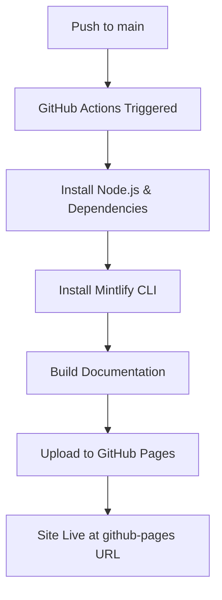

# GitHub Pages Setup for Multisynq Documentation

This guide explains how to enable GitHub Pages and understand the automated deployment workflow for the Multisynq documentation site.

## 🚀 Quick Setup

### 1. Enable GitHub Pages

1. Go to your repository on GitHub
2. Click on **Settings** tab
3. Scroll down to **Pages** section in the left sidebar
4. Under **Source**, select **GitHub Actions**
5. Click **Save**

That's it! GitHub Pages is now configured to use the automated workflow.

### 2. Understanding the Workflow

The workflow file `.github/workflows/deploy-pages.yml` has been created and will:
- ✅ Trigger on every push to `main` branch
- ✅ Copy your documentation files to GitHub Pages
- ✅ Create a redirect to your hosted Mintlify documentation
- ✅ Validate documentation structure on pull requests (without deploying)

### 📝 Important Note about Mintlify

**Mintlify is primarily a hosted service**, not a static site generator. This means:

- **Recommended**: Use Mintlify's hosted service at docs.multisynq.io for the best experience
- **GitHub Pages Setup**: This workflow creates a simple redirect from your GitHub Pages URL to your hosted Mintlify documentation
- **File Backup**: Your documentation files are still copied to GitHub Pages as a backup

### 3. Choose Your Deployment Strategy

You have two main options:

#### Option A: Hosted Mintlify (Recommended)
- Host your documentation at docs.multisynq.io using Mintlify's service
- GitHub Pages redirects visitors to your hosted documentation
- Full Mintlify features including search, analytics, and performance

#### Option B: GitHub Pages Only
- Simple static file hosting on GitHub Pages
- Basic documentation display without advanced Mintlify features
- Good for simple documentation or as a backup

## 📋 Workflow Overview

### What Happens on Every Commit



### Build Process

1. **Environment Setup**: Node.js 18, npm dependencies
2. **Mintlify Installation**: Global installation of Mintlify CLI
3. **File Preparation**: Copy documentation files and create redirect page
4. **Deployment**: Files uploaded to GitHub Pages

## 🔧 Local Development

To test your documentation locally before pushing:

```bash
# Navigate to your project root
cd your-repo-name

# Install dependencies
npm install

# Start development server
npm run docs:dev
# Opens at http://localhost:3001

# Build for production (test the build)
npm run docs:build
# Note: This runs mintlify dev, not a static build

# For GitHub Pages testing
# The workflow will copy files and create redirect
```

## 🌐 Accessing Your Documentation

Once GitHub Pages is enabled and your first deployment completes:

- **GitHub Pages URL**: `https://[username].github.io/[repository-name]/`
- **Custom Domain**: Can be configured in repository Settings > Pages

The URL will be displayed in:
1. Repository Settings > Pages section
2. GitHub Actions workflow summary
3. About section of your repository (once configured)

## 📁 Project Structure

```
your-repo/
├── .github/
│   └── workflows/
│       └── deploy-pages.yml       # 🆕 Deployment workflow
├── docs.json                      # Mintlify configuration
├── package.json                   # Dependencies and scripts
├── index.mdx                      # Homepage
├── quickstart.mdx                 # Getting started
├── api-reference/                 # API documentation
├── tutorials/                     # Tutorials
├── essentials/                    # Core concepts
└── _site/                        # Generated static files (after build)
```

## 🎯 Key Features of the Workflow

### ✅ Automatic Deployment
- Every push to `main` triggers a new deployment
- No manual intervention required
- Documentation stays in sync with your code

### ✅ Pull Request Validation
- PRs are automatically tested for build errors
- Prevents broken deployments
- No deployment for PRs (only validation)

### ✅ Manual Deployment Option
- Can manually trigger deployment from GitHub Actions tab
- Useful for testing or emergency updates

### ✅ Proper Permissions
- Configured with minimal required permissions
- Secure deployment to GitHub Pages

## 🛠️ Troubleshooting

### Build Failures

If the GitHub Actions workflow fails:

1. **Check the Actions tab** in your repository
2. **Review the build logs** for specific errors
3. **Common issues**:
   - Missing dependencies in `package.json`
   - Syntax errors in MDX files
   - Broken links or references
   - Missing required configuration

### Local Testing

Before pushing changes, always test locally:

```bash
# Test the build process
npm run docs:build

# If successful, your changes should deploy correctly
```

### Mintlify-Specific Issues

- **Documentation**: [Mintlify Documentation](https://mintlify.com/docs)
- **CLI Issues**: Reinstall with `npm install -g mintlify@latest`
- **Build Issues**: Check `docs.json` configuration

## 📊 Monitoring Deployments

### GitHub Actions Dashboard
- View deployment status in **Actions** tab
- Each workflow run shows detailed logs
- Failed deployments will show error details

### GitHub Pages Settings
- Shows current deployment status
- Displays the live URL
- Configuration options for custom domains

## 🔄 Workflow Customization

The workflow can be customized by editing `.github/workflows/deploy-pages.yml`:

### Change Trigger Branch
```yaml
on:
  push:
    branches: [ "main", "production" ]  # Add multiple branches
```

### Add Environment Variables
```yaml
env:
  NODE_ENV: production
  MINTLIFY_LICENSE: ${{ secrets.MINTLIFY_LICENSE }}
```

### Custom Build Steps
```yaml
- name: Custom preprocessing
  run: |
    # Add custom build steps here
    echo "Running custom preprocessing..."
```

## 🎉 Success!

Once setup is complete:

1. ✅ Push any changes to the `main` branch
2. ✅ GitHub Actions will automatically build and deploy
3. ✅ Your documentation will be live at the GitHub Pages URL
4. ✅ Updates happen automatically on every commit

Your Multisynq documentation is now automatically deployed to GitHub Pages! 🚀

## 🏆 Recommended Next Steps

For the best documentation experience, consider setting up Mintlify hosting:

### 1. Sign up for Mintlify
1. Go to [mintlify.com](https://mintlify.com)
2. Create an account
3. Connect your GitHub repository
4. Configure your custom domain (docs.multisynq.io)

### 2. Benefits of Mintlify Hosting
- ✅ **Better Performance**: Optimized hosting and CDN
- ✅ **Advanced Search**: AI-powered search functionality  
- ✅ **Analytics**: Detailed documentation usage analytics
- ✅ **Custom Domain**: Professional docs.multisynq.io domain
- ✅ **Auto Updates**: Automatic deployment from your git repository

### 3. GitHub Pages as Backup
Your GitHub Pages setup serves as:
- 📋 **Backup hosting** in case of service issues
- 🔄 **Redirect service** to your main documentation
- 📁 **File backup** of all your documentation content

## 📞 Need Help?

- **GitHub Pages**: [GitHub Pages Documentation](https://docs.github.com/en/pages)
- **GitHub Actions**: [GitHub Actions Documentation](https://docs.github.com/en/actions)
- **Mintlify**: [Mintlify Documentation](https://mintlify.com/docs)