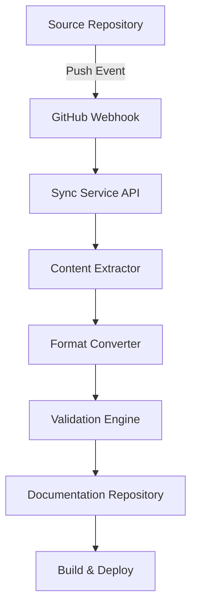

# Automated Syncing Strategy for Multisynq Documentation

## Executive Summary

This document outlines a comprehensive strategy for automatically synchronizing documentation content across multiple Multisynq repositories and sources. The goal is to maintain accurate, up-to-date documentation while minimizing manual maintenance overhead.

## Syncing Sources and Targets

### 1. Croquet Classes Synchronization

**Source:** `croquet/packages/croquet/teatime/*.js` files
**Target:** `/docs/api-reference/croquet/`
**Content Type:** Class definitions, method signatures, JSDoc comments

**Key Files to Sync:**
- `Model.js` → `docs/api-reference/croquet/model.mdx`
- `View.js` → `docs/api-reference/croquet/view.mdx`
- `Session.js` → `docs/api-reference/croquet/session.mdx`
- `Constants.js` → `docs/api-reference/croquet/constants.mdx`

**Extraction Method:**
- Parse JSDoc comments from source files
- Extract class definitions, method signatures, parameters
- Convert to Mintlify-compatible MDX format
- Preserve code examples and usage patterns

### 2. Multisynq-Client Documentation Syncing

**Source:** `multisynq-client/docs/` directory
**Target:** `/docs/tutorials/` and `/docs/api-reference/`
**Content Type:** Tutorials, API documentation, examples

**Key Sync Points:**
- `multisynq-client/docs/tutorials/` → `docs/tutorials/`
- `multisynq-client/docs/QUICKSTART.md` → `docs/quickstart.mdx` (merge)
- `multisynq-client/docs/API.md` → `docs/api-reference/multisynq-client.mdx`
- `multisynq-client/docs/examples/` → `docs/examples/`

### 3. Tutorial Repositories Syncing

**Source:** External repositories (see `TUTORIALS_REPO_LIST.md`)
**Target:** `/docs/examples/` and `/docs/tutorials/advanced/`
**Content Type:** Example applications, advanced tutorials

**Repositories:**
1. **Physics Fountain** (`https://github.com/multisynq/physics-fountain`)
   - Extract: README.md, src/ code examples
   - Target: `docs/examples/physics-fountain.mdx`
   
2. **Multiblaster Lobby** (`https://github.com/multisynq/multiblaster-lobby`)
   - Extract: Game logic, multiplayer patterns
   - Target: `docs/examples/multiblaster-lobby.mdx`
   
3. **VibeCoded Gallery** (`https://github.com/multisynq/vibecoded-gallery`)
   - Extract: Collaborative art patterns
   - Target: `docs/examples/vibecoded-gallery.mdx`

## Synchronization Architecture

### 1. Webhook-Based Real-Time Syncing



**Components:**
- **Webhook Listener:** Receives GitHub webhook events
- **Content Extractor:** Parses source files for documentation content
- **Format Converter:** Converts content to MDX format
- **Validation Engine:** Ensures accuracy and compliance
- **Auto-Committer:** Creates pull requests with changes

### 2. Scheduled Batch Syncing

**Frequency:** Daily at 02:00 UTC
**Purpose:** Catch any missed webhook events, perform comprehensive validation

**Process:**
1. Clone/pull all source repositories
2. Extract content from all configured sources
3. Compare with current documentation
4. Generate change summary
5. Create PR if differences found

### 3. Manual Trigger System

**Interface:** GitHub Actions workflow dispatch
**Use Cases:** 
- Immediate sync after critical updates
- Testing sync process during development
- Recovery from failed automatic syncs

## Content Extraction Methods

### 1. JSDoc Comment Extraction

**Tool:** Custom Node.js parser using AST analysis
**Target:** Croquet teatime classes

```javascript
// Example extraction configuration
const extractionConfig = {
  croquet: {
    source: 'croquet/packages/croquet/teatime/',
    patterns: ['**/*.js'],
    extractors: {
      classes: 'extractClassDefinitions',
      methods: 'extractMethodSignatures',
      examples: 'extractCodeExamples'
    },
    output: 'docs/api-reference/croquet/'
  }
}
```

### 2. Markdown Content Extraction

**Tool:** Remark/Unified.js pipeline
**Target:** Tutorial repositories and documentation files

```javascript
// Example markdown processing pipeline
const markdownProcessor = unified()
  .use(remarkParse)
  .use(remarkFrontmatter)
  .use(remarkMdx)
  .use(remarkStringify)
```

### 3. Code Example Extraction

**Tool:** Babel parser for JavaScript extraction
**Target:** Example applications in tutorial repositories

**Process:**
1. Identify key source files (main.js, model.js, view.js)
2. Extract relevant code patterns
3. Add explanatory comments
4. Convert to documentation-friendly format

## Format Conversion Pipeline

### 1. Markdown to MDX Conversion

**Input:** Raw markdown from source repositories
**Output:** Mintlify-compatible MDX

**Transformations:**
- Add frontmatter with title, description
- Convert code blocks to Mintlify CodeGroup components
- Transform images to use local asset references
- Update links to point to documentation site

### 2. JSDoc to MDX Conversion

**Input:** JSDoc comments and class definitions
**Output:** API reference pages

**Template:**
```mdx
---
title: "{ClassName}"
description: "{classDescription}"
---

## Overview
{classOverview}

## Constructor
{constructorDocs}

## Properties
{propertyDocs}

## Methods
{methodDocs}
```

### 3. Code Example Enhancement

**Process:**
1. Extract functional code examples
2. Add step-by-step explanations
3. Include expected outputs
4. Add troubleshooting notes

## Validation and Quality Control

### 1. Content Validation Rules

**API Accuracy:**
- Verify all mentioned classes/methods exist
- Check parameter types and names
- Validate code example functionality

**Link Validation:**
- Internal links point to existing pages
- External links are accessible
- Image references resolve correctly

**Content Standards:**
- Consistent formatting across all pages
- Proper MDX syntax
- Required frontmatter present

### 2. Automated Testing

**Code Example Testing:**
```javascript
// Automated test for each code example
describe('Tutorial Code Examples', () => {
  it('should execute without errors', async () => {
    const exampleCode = extractCodeFromMdx(tutorialPath);
    const result = await executeInSandbox(exampleCode);
    expect(result.errors).toHaveLength(0);
  });
});
```

**Link Testing:**
- Use link-checker tool on generated documentation
- Validate all internal navigation paths
- Check external dependencies

### 3. Change Review Process

**Automated PR Creation:**
1. Extract content from source repositories
2. Generate documentation updates
3. Create feature branch with changes
4. Open PR with detailed change summary
5. Trigger automated tests and validations
6. Request manual review for significant changes

## Configuration Management

### 1. Sync Configuration File

**Location:** `docs/.sync-config.yml`

```yaml
sources:
  croquet:
    repository: "https://github.com/croquet/croquet"
    path: "packages/croquet/teatime"
    target: "docs/api-reference/croquet"
    extractor: "jsdoc"
    
  multisynq-client:
    repository: "https://github.com/multisynq/multisynq-client"
    path: "docs"
    target: "docs"
    extractor: "markdown"
    
  tutorials:
    - repository: "https://github.com/multisynq/physics-fountain"
      target: "docs/examples/physics-fountain.mdx"
      extractor: "example-app"
    - repository: "https://github.com/multisynq/multiblaster-lobby"  
      target: "docs/examples/multiblaster-lobby.mdx"
      extractor: "example-app"
    - repository: "https://github.com/multisynq/vibecoded-gallery"
      target: "docs/examples/vibecoded-gallery.mdx"
      extractor: "example-app"

extractors:
  jsdoc:
    patterns: ["**/*.js"]
    include: ["classes", "methods", "properties", "examples"]
    
  markdown:
    patterns: ["**/*.md"]
    frontmatter: true
    codeBlocks: true
    
  example-app:
    entryPoints: ["src/index.js", "src/main.js"]
    includeFiles: ["README.md", "package.json"]

validation:
  rules:
    - "no-broken-links"
    - "code-examples-valid"
    - "required-frontmatter"
    - "consistent-formatting"
    
  tests:
    - "link-checker"
    - "code-execution"
    - "mdx-lint"
```

### 2. Environment Configuration

**Required Environment Variables:**
```bash
GITHUB_TOKEN=ghp_xxx               # GitHub API access
DOCS_REPO=multisynq/docs           # Target documentation repository
WEBHOOK_SECRET=xxx                 # GitHub webhook validation
SLACK_WEBHOOK=xxx                  # Notifications channel
```

## Implementation Plan

### Phase 1: Core Infrastructure (Week 1)

**Tasks:**
1. Set up webhook listener service
2. Implement basic content extraction for Croquet classes
3. Create MDX conversion pipeline
4. Set up GitHub Actions workflow

**Deliverables:**
- Working webhook endpoint
- Basic JSDoc → MDX converter
- Automated PR creation

### Phase 2: Content Extractors (Week 2)

**Tasks:**
1. Implement multisynq-client documentation sync
2. Create tutorial repository content extraction
3. Build validation and testing framework
4. Set up notification system

**Deliverables:**
- Complete extraction pipeline
- Automated validation
- Slack/email notifications

### Phase 3: Production Deployment (Week 3)

**Tasks:**
1. Deploy sync service to production
2. Configure webhooks on all source repositories
3. Set up monitoring and alerting
4. Create documentation for maintenance

**Deliverables:**
- Production sync service
- Monitoring dashboard
- Maintenance documentation

## Monitoring and Maintenance

### 1. Sync Health Monitoring

**Metrics to Track:**
- Sync frequency and success rate
- Content extraction accuracy
- Validation pass/fail rates
- Build and deployment status

**Alerting:**
- Failed sync attempts
- Validation errors
- Service downtime
- Large content changes requiring review

### 2. Manual Override Capabilities

**Emergency Procedures:**
- Disable automatic syncing if issues detected
- Manual content review and approval process
- Rollback capabilities for problematic changes
- Direct repository access for urgent fixes

### 3. Regular Maintenance Tasks

**Weekly:**
- Review sync logs for errors or warnings
- Validate generated documentation accuracy
- Check for new source repositories to add

**Monthly:**
- Update sync configuration as needed
- Review and optimize extraction rules
- Performance analysis and improvements

## Success Metrics

### 1. Sync Reliability
- **Target:** 99% successful sync rate
- **Measurement:** Webhook delivery success + content extraction success

### 2. Content Freshness
- **Target:** Documentation updated within 1 hour of source changes
- **Measurement:** Time between source commit and documentation update

### 3. Quality Maintenance
- **Target:** Zero broken links or invalid code examples
- **Measurement:** Automated validation pass rate

### 4. Maintenance Overhead
- **Target:** <2 hours manual work per week
- **Measurement:** Time spent on sync-related maintenance tasks

## Risk Mitigation

### 1. Source Repository Changes
- **Risk:** Breaking changes in source repository structure
- **Mitigation:** Version-aware extraction rules, fallback mechanisms

### 2. API Changes
- **Risk:** Multisynq API changes breaking existing documentation
- **Mitigation:** Automated testing, staged rollouts, manual review triggers

### 3. Service Downtime
- **Risk:** Sync service unavailable during critical updates
- **Mitigation:** Redundant deployment, manual fallback procedures

### 4. Content Quality Issues
- **Risk:** Automated extraction producing incorrect documentation
- **Mitigation:** Validation rules, manual review triggers, rollback capabilities

## Conclusion

This automated syncing strategy provides a robust foundation for maintaining accurate, up-to-date Multisynq documentation across all source repositories. The combination of real-time webhook syncing, comprehensive validation, and manual override capabilities ensures both automation efficiency and quality control.

The phased implementation approach allows for iterative development and testing, minimizing risk while building a production-ready system. With proper monitoring and maintenance procedures, this system will significantly reduce manual documentation maintenance overhead while improving content accuracy and freshness. 