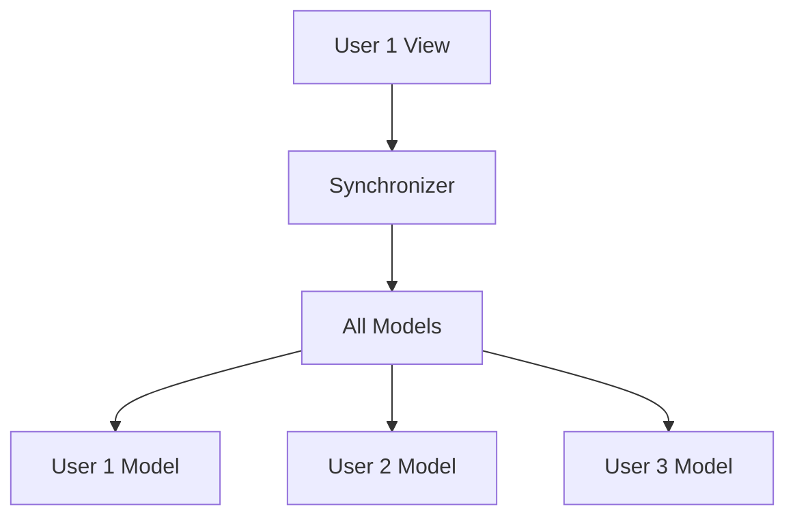
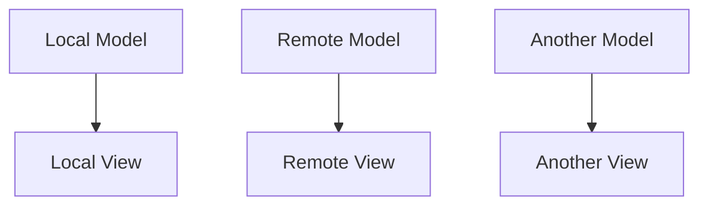

# Events & Pub-Sub

Events are the primary communication mechanism in Multisynq applications. The publish-subscribe (pub-sub) pattern enables clean, decoupled communication between Models and Views while maintaining perfect synchronization.

## Core Event API

<Note>
These functions are only available to classes that inherit from `Multisynq.Model` or `Multisynq.View`.
</Note>

<Tabs>
<Tab title="publish()">
**Sends an event to all subscribers**

```js
publish(scope, event, data)
```

- **scope**: Namespace for the event (String)
- **event**: Name of the event (String)
- **data**: Optional data payload (any serializable type)

```js
// Example: Publishing player input
this.publish("player-123", "move", { direction: "left", speed: 5 });
```
</Tab>

<Tab title="subscribe()">
**Registers to receive events**

```js
subscribe(scope, event, handler)
```

- **scope**: Namespace to listen to (String)
- **event**: Event name to listen for (String)
- **handler**: Function to handle the event

```js
// Example: Subscribing to player input
this.subscribe("player-123", "move", this.handlePlayerMove);
```
</Tab>

<Tab title="unsubscribe()">
**Removes a specific subscription**

```js
unsubscribe(scope, event)
```

```js
// Example: Stop listening to player input
this.unsubscribe("player-123", "move");
```
</Tab>

<Tab title="unsubscribeAll()">
**Removes all subscriptions**

```js
unsubscribeAll()
```

<Note>
Called automatically when you `destroy()` a model or view.
</Note>
</Tab>
</Tabs>

## Handler Requirements

<Warning>
**Critical difference**: Model and View handlers have different requirements!
</Warning>

<Tabs>
<Tab title="Model Handlers">
**Must use method names, not function expressions**

```js
// ✅ Correct - use method name
class GameModel extends Multisynq.Model {
    init() {
        this.subscribe("input", "move", this.handleMove);
    }
    
    handleMove(data) {
        // Handle the move
    }
}
```

```js
// ❌ Incorrect - function expressions don't work
class GameModel extends Multisynq.Model {
    init() {
        this.subscribe("input", "move", (data) => {
            // This won't work in models!
        });
    }
}
```

<Note>
This is because functions cannot be serialized, so only the method name is stored.
</Note>
</Tab>

<Tab title="View Handlers">
**Can use any function form**

```js
// ✅ All of these work in views
class GameView extends Multisynq.View {
    init() {
        // Method name
        this.subscribe("ui", "update", this.handleUpdate);
        
        // Arrow function
        this.subscribe("ui", "alert", (message) => {
            alert(message);
        });
        
        // Anonymous function
        this.subscribe("ui", "log", function(data) {
            console.log(data);
        });
    }
    
    handleUpdate(data) {
        // Handle the update
    }
}
```
</Tab>
</Tabs>

## Event Routing Patterns

Understanding event routing is crucial for proper Multisynq development:

<Tabs>
<Tab title="View → Model">
**Events are transmitted to the synchronizer and mirrored to all users**

```js
// View publishes
this.publish("game", "player-action", { type: "jump" });

// Model receives on ALL devices during next simulation
this.subscribe("game", "player-action", this.handlePlayerAction);
```

<Info>
**Use case**: User input, game actions, any synchronized state changes
</Info>


</Tab>

<Tab title="Model → View">
**Events are queued and handled locally after simulation**

```js
// Model publishes locally
this.publish("effects", "explosion", { x: 100, y: 200 });

// View receives only on local device
this.subscribe("effects", "explosion", this.showExplosion);
```

<Info>
**Use case**: Visual effects, audio cues, local UI updates
</Info>


</Tab>

<Tab title="Model → Model">
**Events are executed immediately and synchronously**

```js
// Model publishes to another model
this.publish("internal", "calculate", { values: [1, 2, 3] });

// Another model receives immediately
this.subscribe("internal", "calculate", this.performCalculation);
```

<Info>
**Use case**: Internal model organization, component communication
</Info>

<Warning>
Handler executes immediately, before the publish call returns.
</Warning>
</Tab>

<Tab title="View → View">
**Events are queued and handled in the same update cycle**

```js
// View publishes to another view
this.publish("ui", "toggle-panel", { panel: "settings" });

// Another view receives in same update cycle
this.subscribe("ui", "toggle-panel", this.handlePanelToggle);
```

<Info>
**Use case**: UI state management, local interface coordination
</Info>
</Tab>
</Tabs>

## Scopes and Namespacing

Scopes provide namespacing to avoid event name conflicts and enable targeted communication:

<Tabs>
<Tab title="Global Scopes">
**Built-in scopes available everywhere**

```js
// Session-wide events
this.subscribe(this.sessionId, "game-start", this.handleGameStart);

// User-specific events
this.subscribe(this.viewId, "user-input", this.handleUserInput);

// Public events
this.subscribe("public", "announcement", this.handleAnnouncement);
```
</Tab>

<Tab title="Model ID Scopes">
**Target specific model instances**

```js
class Player extends Multisynq.Model {
    init() {
        // Listen to events for this specific player
        this.subscribe(this.id, "move", this.handleMove);
        this.subscribe(this.id, "attack", this.handleAttack);
    }
}

// Send event to specific player
this.publish(playerId, "move", { direction: "up" });
```
</Tab>

<Tab title="Custom Scopes">
**Create your own namespaces**

```js
// Team-based events
this.subscribe("team-red", "strategy", this.handleTeamStrategy);
this.subscribe("team-blue", "strategy", this.handleTeamStrategy);

// System events
this.subscribe("system", "error", this.handleSystemError);
this.subscribe("system", "warning", this.handleSystemWarning);
```
</Tab>
</Tabs>

## Practical Examples

<AccordionGroup>
<Accordion title="🎮 Game Input System" icon="gamepad">
**Complete input handling pattern**

```js
class GameView extends Multisynq.View {
    init() {
        document.addEventListener('keydown', (e) => {
            // Send input to model
            this.publish(this.viewId, "input", {
                key: e.key,
                action: "down"
            });
        });
        
        document.addEventListener('keyup', (e) => {
            this.publish(this.viewId, "input", {
                key: e.key,
                action: "up"
            });
        });
    }
}

class GameModel extends Multisynq.Model {
    init() {
        this.players = new Map();
        // Listen for all player inputs
        this.subscribe("*", "input", this.handleInput);
    }
    
    handleInput(data) {
        const playerId = this.getEventSender();
        const player = this.players.get(playerId);
        if (player) {
            player.processInput(data);
        }
    }
}
```
</Accordion>

<Accordion title="🎨 Visual Effects System" icon="wand-magic-sparkles">
**Model-triggered visual effects**

```js
class GameModel extends Multisynq.Model {
    explodeAsteroid(asteroid) {
        // Destroy the asteroid
        asteroid.destroy();
        
        // Trigger visual effect locally
        this.publish("effects", "explosion", {
            x: asteroid.x,
            y: asteroid.y,
            size: asteroid.size
        });
    }
}

class GameView extends Multisynq.View {
    init() {
        this.particles = [];
        this.subscribe("effects", "explosion", this.createExplosion);
    }
    
    createExplosion(data) {
        // Create particle effect
        for (let i = 0; i < 10; i++) {
            this.particles.push(new Particle(data.x, data.y));
        }
    }
}
```
</Accordion>

<Accordion title="🤖 AI Agent Communication" icon="robot">
**Agent-specific communication channels**

```js
class AIAgent extends Multisynq.Model {
    init() {
        // Each agent has its own communication channel
        this.subscribe(this.id, "command", this.handleCommand);
        this.subscribe(this.id, "sensor-data", this.processSensorData);
    }
    
    handleCommand(command) {
        switch(command.type) {
            case "move":
                this.moveTo(command.target);
                break;
            case "attack":
                this.attackTarget(command.target);
                break;
        }
    }
    
    reportStatus() {
        // Report to central command
        this.publish("command", "agent-status", {
            id: this.id,
            status: this.status,
            position: { x: this.x, y: this.y }
        });
    }
}
```
</Accordion>
</AccordionGroup>

## Best Practices

<CardGroup cols={2}>
<Card title="🎯 Targeted Communication" icon="bullseye">
**Use specific scopes for efficient communication**

```js
// ✅ Good - specific scope
this.publish(playerId, "player-event", data);

// ❌ Avoid - broad scope when specific is better
this.publish("global", "player-event", data);
```
</Card>

<Card title="📦 Small Payloads" icon="box">
**Keep event data small and simple**

```js
// ✅ Good - minimal data
this.publish("input", "move", { direction: "left" });

// ❌ Avoid - large data structures
this.publish("input", "move", { 
    player: entirePlayerObject,
    gameState: entireGameState
});
```
</Card>

<Card title="🔄 Avoid Chains" icon="chain">
**Don't create Model → View → Model chains**

```js
// ❌ Avoid this pattern
class GameModel extends Multisynq.Model {
    someMethod() {
        // Model triggers view event
        this.publish("ui", "update", data);
    }
}

class GameView extends Multisynq.View {
    init() {
        this.subscribe("ui", "update", (data) => {
            // View triggers model event - BAD!
            this.publish("model", "response", processedData);
        });
    }
}
```
</Card>

<Card title="🧹 Clean Up" icon="broom">
**Unsubscribe when no longer needed**

```js
class TemporaryComponent extends Multisynq.View {
    init() {
        this.subscribe("temp", "event", this.handler);
    }
    
    destroy() {
        this.unsubscribe("temp", "event");
        // Or use unsubscribeAll() for all subscriptions
        super.destroy();
    }
}
```
</Card>
</CardGroup>

## Common Patterns

<Tabs>
<Tab title="State Updates">
**Centralized state management**

```js
class GameState extends Multisynq.Model {
    init() {
        this.score = 0;
        this.level = 1;
        
        this.subscribe("game", "score", this.updateScore);
        this.subscribe("game", "level", this.updateLevel);
    }
    
    updateScore(points) {
        this.score += points;
        this.publish("ui", "score-changed", this.score);
    }
    
    updateLevel(newLevel) {
        this.level = newLevel;
        this.publish("ui", "level-changed", this.level);
    }
}
```
</Tab>

<Tab title="Lifecycle Events">
**Object creation and destruction**

```js
class Player extends Multisynq.Model {
    init() {
        // Announce player joined
        this.publish("players", "joined", {
            id: this.id,
            name: this.name
        });
    }
    
    destroy() {
        // Announce player left
        this.publish("players", "left", {
            id: this.id,
            name: this.name
        });
        
        super.destroy();
    }
}
```
</Tab>

<Tab title="Timer Events">
**Time-based event systems**

```js
class GameTimer extends Multisynq.Model {
    init() {
        this.timeLeft = 60;
        this.tick();
    }
    
    tick() {
        this.timeLeft--;
        
        // Notify views of time change
        this.publish("timer", "update", this.timeLeft);
        
        if (this.timeLeft <= 0) {
            this.publish("game", "time-up", {});
        } else {
            this.future(1000).tick();
        }
    }
}
```
</Tab>
</Tabs>

## Event Debugging

<Tabs>
<Tab title="Event Logging">
**Track event flow in development**

```js
class DebugModel extends Multisynq.Model {
    publish(scope, event, data) {
        console.log(`[MODEL] Publishing: ${scope}:${event}`, data);
        super.publish(scope, event, data);
    }
    
    subscribe(scope, event, handler) {
        console.log(`[MODEL] Subscribing to: ${scope}:${event}`);
        super.subscribe(scope, event, handler);
    }
}
```
</Tab>

<Tab title="Event Validation">
**Validate event data structure**

```js
class ValidatedModel extends Multisynq.Model {
    publish(scope, event, data) {
        // Validate data can be serialized
        try {
            JSON.stringify(data);
        } catch (e) {
            console.error(`Invalid event data for ${scope}:${event}`, e);
            return;
        }
        
        super.publish(scope, event, data);
    }
}
```
</Tab>
</Tabs>

## Performance Considerations

<Warning>
**Avoid these performance pitfalls:**

1. **High-frequency events**: Don't publish events every frame
2. **Large payloads**: Keep event data minimal
3. **Circular subscriptions**: Avoid event loops
4. **Unused subscriptions**: Always clean up when done
</Warning>

<Tabs>
<Tab title="Throttling">
**Limit event frequency**

```js
class ThrottledInput extends Multisynq.View {
    init() {
        this.lastMove = 0;
        document.addEventListener('mousemove', this.handleMouseMove);
    }
    
    handleMouseMove(e) {
        const now = Date.now();
        if (now - this.lastMove < 16) return; // ~60fps max
        
        this.lastMove = now;
        this.publish("input", "mouse-move", {
            x: e.clientX,
            y: e.clientY
        });
    }
}
```
</Tab>

<Tab title="Batching">
**Group related events**

```js
class BatchedUpdates extends Multisynq.Model {
    init() {
        this.pendingUpdates = [];
        this.batchTimer = null;
    }
    
    queueUpdate(update) {
        this.pendingUpdates.push(update);
        
        if (!this.batchTimer) {
            this.batchTimer = this.future(100).processBatch();
        }
    }
    
    processBatch() {
        if (this.pendingUpdates.length > 0) {
            this.publish("batch", "updates", this.pendingUpdates);
            this.pendingUpdates = [];
        }
        this.batchTimer = null;
    }
}
```
</Tab>
</Tabs>

## Next Steps

<CardGroup cols={2}>
<Card title="Writing a Multisynq Model" icon="cogs" href="/tutorials/writing-multisynq-model">
  Learn how to build robust, event-driven models
</Card>

<Card title="Writing a Multisynq View" icon="eye" href="/tutorials/writing-multisynq-view">
  Master view development and user interaction
</Card>

<Card title="Snapshots" icon="camera" href="/tutorials/snapshots">
  Understand state persistence and recovery
</Card>

<Card title="Sim Time & Future" icon="clock" href="/tutorials/sim-time-future">
  Master time-based behaviors and scheduling
</Card>
</CardGroup>

<Note>
Events are the nervous system of Multisynq applications. Understanding when and how to use them effectively is crucial for building responsive, maintainable multiplayer experiences.
</Note> 