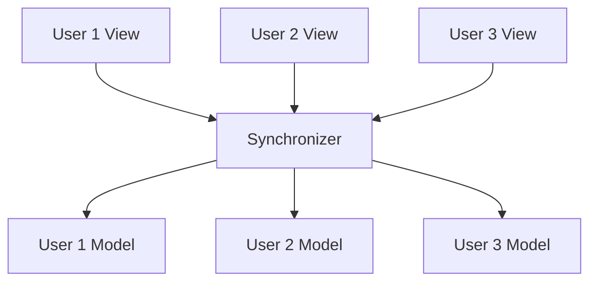

Understanding the Model-View-Synchronizer (MVS) architecture is fundamental to building successful Multisynq applications. This pattern ensures perfect synchronization across all users while maintaining clean separation of concerns.


## Core Components

<CardGroup cols={2}>
<Card title="📱 View" icon="eye">
**Handles user input and output**
- Processes keyboard, mouse, and touch events
- Determines what's displayed on screen
- Interacts with the DOM
- **State is NOT synchronized** across users
</Card>

<Card title="⚙️ Model" icon="cogs">
**Handles calculation and simulation**
- Contains all application logic
- Manages shared state
- **State is ALWAYS identical** for all users
- Runs deterministic computations
</Card>
</CardGroup>

<Card title="☁️ Synchronizer" icon="cloud">
**Stateless cloud service**
- Routes events between users
- Mirrors events to all session participants
- Handles snapshot storage and retrieval
- Manages session membership
</Card>

## Key Principles

<AccordionGroup>
<Accordion title="🔐 Guaranteed State Synchronization" icon="lock">
**The model state is guaranteed to always be identical for all users.**

This is the fundamental promise of Multisynq. No matter how many users are in a session, their model state will be perfectly synchronized. This eliminates the complexity of managing distributed state.

```js
// This state is identical across all users
class Game extends Multisynq.Model {
    init() {
        this.score = 0;        // Same for everyone
        this.players = [];     // Same for everyone
        this.gameState = "active"; // Same for everyone
    }
}
```
</Accordion>

<Accordion title="🎨 View Flexibility" icon="palette">
**View state is NOT synchronized and can differ between users.**

This allows for personalized experiences while maintaining shared core functionality. Users can have different UI preferences, screen sizes, or device capabilities.

```js
class GameView extends Multisynq.View {
    init() {
        this.darkMode = localStorage.getItem('darkMode'); // User-specific
        this.screenSize = window.innerWidth;              // Device-specific
        this.notifications = [];                          // Local only
    }
}
```
</Accordion>

<Accordion title="📡 Event-Driven Communication" icon="satellite">
**All communication happens through events.**

Events provide a clean, decoupled way for components to communicate. The routing is handled automatically by Multisynq.

```js
// View publishes events to model
this.publish("user-input", { action: "move", direction: "left" });

// Model subscribes to events
this.subscribe("user-input", this.handleUserInput);
```
</Accordion>
</AccordionGroup>

## Session Architecture

<Steps>
<Step title="Session Creation">
When a Multisynq application starts, it joins a **session**. Users with the same session ID will share the same synchronized state.

```js
Multisynq.Session.join({
    name: "my-game-session",
    password: "secret123",
    model: GameModel,
    view: GameView
});
```
</Step>

<Step title="Synchronization">
The **synchronizer** ensures all users receive the same events in the same order, maintaining deterministic execution.


</Step>

<Step title="Snapshot Management">
**Snapshots** are periodically saved to the cloud. New users can join by loading a recent snapshot instead of replaying all events from the beginning.

```js
// Snapshots are handled automatically
// New users join by loading the latest snapshot
// then applying recent events to catch up
```
</Step>
</Steps>

## Event Routing Rules

<Note>
Understanding these routing rules is crucial for proper Multisynq development:
</Note>

<Tabs>
<Tab title="View → Model">
**Events from view to model are reflected to all users**

```js
// View publishes
this.publish("player-action", { type: "jump" });

// Model receives on ALL devices
this.subscribe("player-action", this.handlePlayerAction);
```

This ensures all users see the same game state changes.
</Tab>

<Tab title="Model → View">
**Events from model to view are executed locally only**

```js
// Model publishes locally
this.publish("game-event", { type: "explosion" });

// View receives only on local device
this.subscribe("game-event", this.showExplosion);
```

This allows for local feedback without network overhead.
</Tab>

<Tab title="View → View">
**Events between views are local only**

```js
// Useful for UI state management
this.publish("ui-toggle", { panel: "settings" });
```

Perfect for managing local UI state.
</Tab>

<Tab title="Model → Model">
**Events between models are local only**

```js
// Internal model communication
this.publish("internal-update", { data: calculations });
```

Used for internal model organization.
</Tab>
</Tabs>

## Data Flow Constraints

<Warning>
**Critical Rule**: The view can read from the model, but can't write to it directly.
</Warning>

<Tabs>
<Tab title="✅ Correct">
```js
class GameView extends Multisynq.View {
    update() {
        // ✅ Reading from model is allowed
        const score = this.model.score;
        const players = this.model.players;
        
        // ✅ Publishing events to model is allowed
        this.publish("user-input", { action: "move" });
        
        // ✅ Updating local view state is allowed
        this.localState.lastUpdate = Date.now();
    }
}
```
</Tab>

<Tab title="❌ Incorrect">
```js
class GameView extends Multisynq.View {
    update() {
        // ❌ Never directly modify model state
        this.model.score = 100;
        this.model.players.push(newPlayer);
        
        // ❌ This breaks synchronization!
        this.model.gameState = "paused";
    }
}
```
</Tab>
</Tabs>

## Practical Example

Here's how the MVS pattern works in practice:

<Tabs>
<Tab title="Model (Synchronized)">
```js
class GameModel extends Multisynq.Model {
    init() {
        this.players = new Map();
        this.gameState = "waiting";
        
        // Subscribe to view events
        this.subscribe("player-join", this.addPlayer);
        this.subscribe("player-move", this.movePlayer);
    }
    
    addPlayer(playerData) {
        // This runs on ALL devices
        const player = Player.create(playerData);
        this.players.set(player.id, player);
        
        // Notify views locally
        this.publish("player-added", player);
    }
    
    movePlayer({ playerId, direction }) {
        // This runs on ALL devices
        const player = this.players.get(playerId);
        if (player) {
            player.move(direction);
        }
    }
}
```
</Tab>

<Tab title="View (Local)">
```js
class GameView extends Multisynq.View {
    init() {
        this.canvas = document.getElementById('game-canvas');
        this.ctx = this.canvas.getContext('2d');
        
        // Subscribe to model events
        this.subscribe("player-added", this.onPlayerAdded);
        
        // Handle user input
        document.addEventListener('keydown', this.handleKeyDown);
    }
    
    handleKeyDown(event) {
        // Send to model via event
        this.publish("player-move", {
            playerId: this.viewId,
            direction: event.key
        });
    }
    
    update() {
        // Read from model (allowed)
        const players = this.model.players;
        
        // Render locally
        this.ctx.clearRect(0, 0, this.canvas.width, this.canvas.height);
        for (const player of players.values()) {
            this.drawPlayer(player);
        }
    }
    
    onPlayerAdded(player) {
        // Local feedback only
        this.showNotification(`${player.name} joined!`);
    }
}
```
</Tab>
</Tabs>

## Benefits of MVS Architecture

<CardGroup cols={2}>
<Card title="🎯 Perfect Synchronization" icon="bullseye">
All users see exactly the same state at all times, eliminating sync bugs and conflicts.
</Card>

<Card title="🔧 Clean Architecture" icon="wrench">
Clear separation between business logic (Model) and presentation (View) improves maintainability.
</Card>

<Card title="📈 Scalability" icon="chart-line">
Deterministic execution means no server-side state management or complex conflict resolution.
</Card>

<Card title="🚀 Performance" icon="rocket">
Local computation with synchronized results provides excellent performance and responsiveness.
</Card>
</CardGroup>

## Best Practices

<AccordionGroup>
<Accordion title="🏗️ Model Design" icon="building">
- Keep models deterministic and side-effect free
- Use `future()` for time-based behaviors
- Avoid external dependencies in models
- Make model state easily serializable
</Accordion>

<Accordion title="🎨 View Design" icon="palette">
- Handle all user input in the view
- Use local state for UI-specific data
- Avoid blocking operations in the view
- Keep views responsive and interactive
</Accordion>

<Accordion title="📡 Event Design" icon="satellite">
- Use clear, descriptive event names
- Keep event payloads small and simple
- Avoid high-frequency events when possible
- Use scoped events for user-specific actions
</Accordion>
</AccordionGroup>

## Common Pitfalls

<Warning>
**Avoid these common mistakes:**

1. **Direct Model Mutation**: Never modify model state directly from the view
2. **Async Operations in Models**: Models must be deterministic and synchronous
3. **Heavy View Events**: Don't send large data payloads in events
4. **Circular Dependencies**: Avoid event loops between model and view
</Warning>

## Next Steps

<CardGroup cols={2}>
<Card title="Writing a Multisynq Model" icon="cogs" href="/tutorials/writing-multisynq-model">
  Learn how to build robust, synchronized models
</Card>

<Card title="Writing a Multisynq View" icon="eye" href="/tutorials/writing-multisynq-view">
  Master view development and user interaction
</Card>

<Card title="Events & Pub-Sub" icon="satellite" href="/tutorials/events-pub-sub">
  Deep dive into event-driven communication
</Card>

<Card title="Snapshots" icon="camera" href="/tutorials/snapshots">
  Understand state persistence and recovery
</Card>
</CardGroup>

<Note>
The Model-View-Synchronizer pattern is the foundation of all Multisynq applications. Understanding this architecture deeply will help you build more robust, maintainable, and scalable multiplayer experiences.
</Note> 