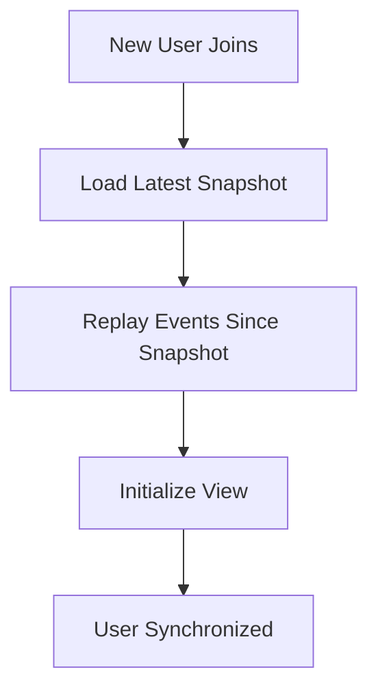

# Snapshots

Snapshots are automatic copies of the model state that Multisynq saves to the cloud. This system provides seamless persistence and enables new users to join existing sessions efficiently without replaying the entire event history.

## What Are Snapshots?

<Card title="📸 Snapshot Definition" icon="camera">
**Snapshots are serialized copies of your complete model state**, saved periodically to the cloud. They capture:
- All model properties and data
- Current object relationships
- Session state at a specific moment
- Everything needed to restore the exact state
</Card>

<Info>
Snapshots are taken automatically by the Multisynq system - you don't need to manually create them.
</Info>

## How Snapshots Work

<Steps>
<Step title="Automatic Creation">
The Multisynq reflector periodically requests one of the session participants to create a snapshot of the current model state.

```js
// This happens automatically - no code needed
// The system serializes your entire model state
```
</Step>

<Step title="Cloud Storage">
The snapshot is compressed and stored in the cloud, associated with your session ID.

```js
// Snapshots are stored with metadata:
// - Session ID
// - Timestamp
// - Model state hash
// - Event sequence number
```
</Step>

<Step title="Restoration">
When needed, the snapshot is loaded and your model state is restored exactly as it was.

```js
// Your model's init() method won't be called
// The state is restored directly from the snapshot
```
</Step>
</Steps>

## Snapshot Use Cases

<Tabs>
<Tab title="🔄 Session Persistence">
**Automatic save functionality for your application**

When users quit or reload:
1. Session state is preserved in the latest snapshot
2. When they return, the exact state is restored
3. No progress is lost

```js
// Example: Game state preservation
class GameModel extends Multisynq.Model {
    init() {
        this.level = 1;
        this.score = 0;
        this.playerPositions = new Map();
    }
    
    // All of this state is automatically saved in snapshots
    // and restored when the session resumes
}
```
</Tab>

<Tab title="🚀 New User Synchronization">
**Efficient joining of existing sessions**

When a new user joins an active session:
1. **Load snapshot**: Get the most recent state
2. **Replay events**: Apply events since the snapshot
3. **Sync complete**: Now in sync with other users


</Tab>
</Tabs>

## New User Join Process

<AccordionGroup>
<Accordion title="1. Snapshot Loading" icon="download">
**The local model is initialized with data from the last snapshot**

```js
// Instead of calling init(), your model is restored from snapshot
// This bypasses normal initialization
class GameModel extends Multisynq.Model {
    init() {
        // This WON'T be called for users joining from snapshot
        console.log("Fresh session start");
    }
}
```

<Warning>
Your model's `init()` method is NOT called when loading from a snapshot.
</Warning>
</Accordion>

<Accordion title="2. Event Replay" icon="play">
**The reflector resends all events transmitted after the snapshot**

```js
// All events since the snapshot are replayed
// This brings the snapshot up to the current state
// Events are processed in the exact same order
```

<Info>
Event replay is deterministic - the same events produce the same results.
</Info>
</Accordion>

<Accordion title="3. Model Simulation" icon="forward">
**The model simulates all events to bring the snapshot up-to-date**

```js
// Your model processes all missed events
// This happens automatically and synchronously
// The model becomes current with other users
```
</Accordion>

<Accordion title="4. View Initialization" icon="eye">
**The local view initializes to match the model state**

```js
class GameView extends Multisynq.View {
    init() {
        // This IS called for snapshot joins
        // Your view should be prepared to handle existing state
        this.canvas = document.getElementById('canvas');
        
        // The model may already have data from the snapshot
        this.displayExistingPlayers();
    }
    
    displayExistingPlayers() {
        // Handle the case where players already exist
        for (const player of this.model.players.values()) {
            this.createPlayerVisual(player);
        }
    }
}
```
</Accordion>
</AccordionGroup>

## View Initialization Considerations

<Warning>
**Important**: When writing your View initialization, account for the fact that the Model may have been restored from a snapshot and already contains data.
</Warning>

<Tabs>
<Tab title="❌ Problematic Approach">
```js
class GameView extends Multisynq.View {
    init() {
        this.players = new Map();
        
        // This assumes the model starts empty
        // But it might already have players from a snapshot!
        this.subscribe("player", "joined", this.addPlayer);
    }
    
    addPlayer(player) {
        this.players.set(player.id, new PlayerVisual(player));
    }
    
    // Missing: handling existing players from snapshot
}
```
</Tab>

<Tab title="✅ Correct Approach">
```js
class GameView extends Multisynq.View {
    init() {
        this.players = new Map();
        
        // Handle existing players from snapshot
        this.initializeExistingPlayers();
        
        // Subscribe to future player events
        this.subscribe("player", "joined", this.addPlayer);
        this.subscribe("player", "left", this.removePlayer);
    }
    
    initializeExistingPlayers() {
        // Check if model already has players (from snapshot)
        for (const player of this.model.players.values()) {
            this.createPlayerVisual(player);
        }
    }
    
    createPlayerVisual(player) {
        const visual = new PlayerVisual(player);
        this.players.set(player.id, visual);
    }
    
    addPlayer(player) {
        this.createPlayerVisual(player);
    }
    
    removePlayer(playerId) {
        const visual = this.players.get(playerId);
        if (visual) {
            visual.destroy();
            this.players.delete(playerId);
        }
    }
}
```
</Tab>
</Tabs>

## Snapshot Performance

<Warning>
**Current Limitation**: The snapshot system is currently unoptimized and may cause performance hitches when snapshots are taken.
</Warning>

<Tabs>
<Tab title="🐌 Current Behavior">
- **Performance hitch**: Brief pause when snapshot is taken
- **Visible to users**: May notice application freeze
- **Depends on model size**: Larger models = longer pause

```js
// During snapshot creation:
// 1. Model state is serialized
// 2. Data is compressed
// 3. Snapshot is transmitted
// 4. Normal execution resumes
```
</Tab>

<Tab title="🔄 Mitigation Strategies">
**Until the system is optimized, you can:**

1. **Keep models lean**: Avoid storing unnecessary data
2. **Use efficient data structures**: Prefer simple objects over complex ones
3. **Clean up regularly**: Remove unused objects
4. **Monitor model size**: Be aware of your state footprint

```js
class OptimizedModel extends Multisynq.Model {
    init() {
        // Use efficient data structures
        this.players = new Map(); // Better than array for lookups
        this.cleanup();
    }
    
    cleanup() {
        // Regularly clean up unused data
        this.future(10000).cleanup();
        
        // Remove expired objects
        for (const [id, player] of this.players) {
            if (player.isExpired()) {
                this.players.delete(id);
            }
        }
    }
}
```
</Tab>
</Tabs>

## Best Practices

<CardGroup cols={2}>
<Card title="📊 Model Design" icon="chart-line">
**Keep your model state snapshot-friendly**

- Use simple, serializable data types
- Avoid circular references
- Keep the state tree flat when possible
- Clean up unused objects regularly

```js
// Good for snapshots
this.score = 100;
this.players = new Map();
this.gameState = "active";

// Avoid complex nested structures
this.deepNestedData = {...};
```
</Card>

<Card title="🎨 View Initialization" icon="palette">
**Design views to handle existing state**

- Check for existing model data in `init()`
- Create visuals for pre-existing objects
- Subscribe to future events
- Handle both fresh starts and snapshot loads

```js
init() {
    // Handle snapshot case
    this.initializeExistingState();
    
    // Handle future events
    this.subscribeToEvents();
}
```
</Card>

<Card title="🧪 Testing" icon="flask">
**Test your snapshot behavior**

- Test fresh session starts
- Test joining existing sessions
- Verify state restoration
- Check view initialization

```js
// Test both scenarios:
// 1. Fresh session (init() called)
// 2. Snapshot join (init() not called)
```
</Card>

<Card title="⚡ Performance" icon="bolt">
**Optimize for snapshot performance**

- Monitor your model size
- Use efficient data structures
- Clean up regularly
- Avoid storing view-specific data in models

```js
// Good: Store only essential state
this.gameLogic = essentialData;

// Bad: Store view-specific data
this.uiElements = domElements;
```
</Card>
</CardGroup>

## Debugging Snapshots

<Tabs>
<Tab title="Snapshot Detection">
**Detect if your model loaded from a snapshot**

```js
class GameModel extends Multisynq.Model {
    init() {
        // This only runs for fresh sessions
        this.fromSnapshot = false;
        console.log("Fresh session start");
    }
    
    // Called after snapshot restore OR fresh init
    start() {
        if (!this.fromSnapshot) {
            this.fromSnapshot = true;
            console.log("Loaded from snapshot");
        }
    }
}
```
</Tab>

<Tab title="State Validation">
**Verify snapshot state is correct**

```js
class GameModel extends Multisynq.Model {
    validateState() {
        // Check state integrity after snapshot load
        console.log("Players:", this.players.size);
        console.log("Game state:", this.gameState);
        console.log("Score:", this.score);
        
        // Verify relationships
        for (const player of this.players.values()) {
            if (!player.isValid()) {
                console.error("Invalid player state:", player);
            }
        }
    }
}
```
</Tab>
</Tabs>

## Common Patterns

<AccordionGroup>
<Accordion title="🎮 Game State Snapshots" icon="gamepad">
**Preserving game progress across sessions**

```js
class GameModel extends Multisynq.Model {
    init() {
        // Fresh game start
        this.level = 1;
        this.score = 0;
        this.players = new Map();
        this.gameState = "waiting";
        this.startTime = Date.now();
    }
    
    // All this state is automatically preserved
    // When users rejoin, they continue exactly where they left off
}

class GameView extends Multisynq.View {
    init() {
        // Handle both fresh starts and snapshot resumes
        this.initializeUI();
        this.displayCurrentState();
    }
    
    displayCurrentState() {
        // Show current level, score, etc.
        this.updateScore(this.model.score);
        this.updateLevel(this.model.level);
        
        // Display existing players
        for (const player of this.model.players.values()) {
            this.createPlayerDisplay(player);
        }
    }
}
```
</Accordion>

<Accordion title="💬 Chat History" icon="comments">
**Preserving conversation history**

```js
class ChatModel extends Multisynq.Model {
    init() {
        this.messages = [];
        this.users = new Map();
    }
    
    addMessage(message) {
        this.messages.push(message);
        
        // Keep only last 100 messages for snapshot efficiency
        if (this.messages.length > 100) {
            this.messages.shift();
        }
    }
}

class ChatView extends Multisynq.View {
    init() {
        this.chatContainer = document.getElementById('chat');
        
        // Display existing messages from snapshot
        this.displayMessageHistory();
        
        // Subscribe to new messages
        this.subscribe("chat", "message", this.displayMessage);
    }
    
    displayMessageHistory() {
        for (const message of this.model.messages) {
            this.displayMessage(message);
        }
    }
}
```
</Accordion>
</AccordionGroup>

## Future Improvements

<Info>
The Multisynq development team is working to make snapshots invisible to both users and developers:

- **Invisible performance**: No more hitches during snapshot creation
- **Optimized storage**: Smaller snapshots, faster loading
- **Better compression**: Reduced network overhead
- **Incremental snapshots**: Only save changes since last snapshot
</Info>

## Next Steps

<CardGroup cols={2}>
<Card title="Persistence" icon="database" href="/tutorials/persistence">
  Learn about explicit persistence beyond snapshots
</Card>

<Card title="Writing a Multisynq Model" icon="cogs" href="/tutorials/writing-multisynq-model">
  Master model development for snapshot-friendly code
</Card>

<Card title="Writing a Multisynq View" icon="eye" href="/tutorials/writing-multisynq-view">
  Learn to handle both fresh starts and snapshot loads
</Card>

<Card title="Sim Time & Future" icon="clock" href="/tutorials/sim-time-future">
  Understand time-based behaviors in snapshotted sessions
</Card>
</CardGroup>

<Note>
Snapshots are fundamental to Multisynq's persistence and scalability. Understanding how they work will help you design better models and views that handle session continuity seamlessly.
</Note> 